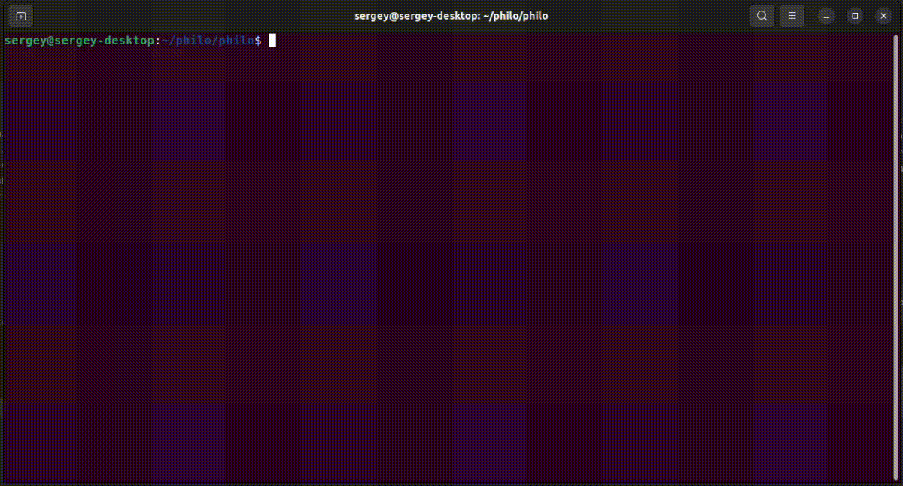

# Philosophers

### Description
A project about introduction to the basics of multiprocessing and
multithreading, based on Dining Philosophers problem designed to illustrate 
synchronization issues and techniques for resolving them.

**philo:** multithreading with mutex  
**philo_bonus:** multiprocessing with semaphore

### Rules
- One or more philosophers sit at a round table.
- There is a large bowl of spaghetti in the middle of the table.
- The philosophers alternatively eat, think, or sleep.
- While they are eating, they are not thinking nor sleeping;
- while thinking, they are not eating nor sleeping;
and, of course, while sleeping, they are not eating nor thinking.
- There are also forks on the table. There are as many forks as philosophers.
- Because serving and eating spaghetti with only one fork is very inconvenient, a
philosopher takes their right and their left forks to eat, one in each hand.
- When a philosopher has finished eating, they put their forks back on the table and
start sleeping. Once awake, they start thinking again. The simulation stops when
a philosopher dies of starvation.
- Every philosopher needs to eat and should never starve.
- Philosophers don’t speak with each other.
- Philosophers don’t know if another philosopher is about to die.
- Philosophers should avoid dying!

### Usage
    ./philo <amount of philos> <time to die> <time to eat> <time to sleep> [number of meals]

### Example
    ./philo 5 800 200 200

No one should die
